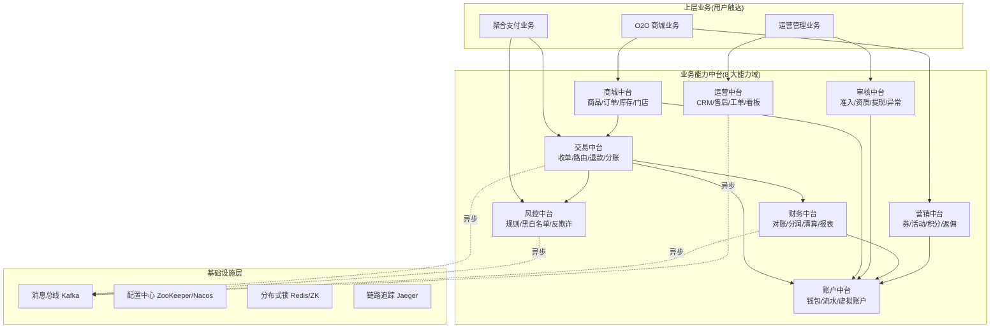
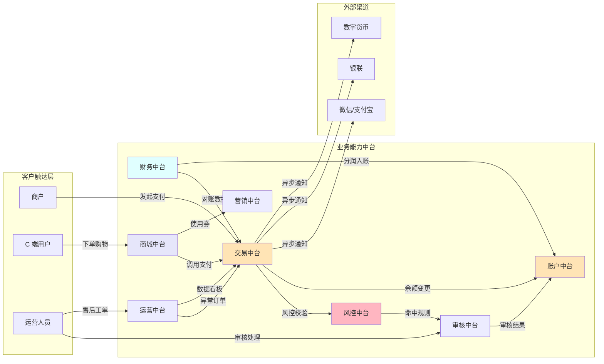
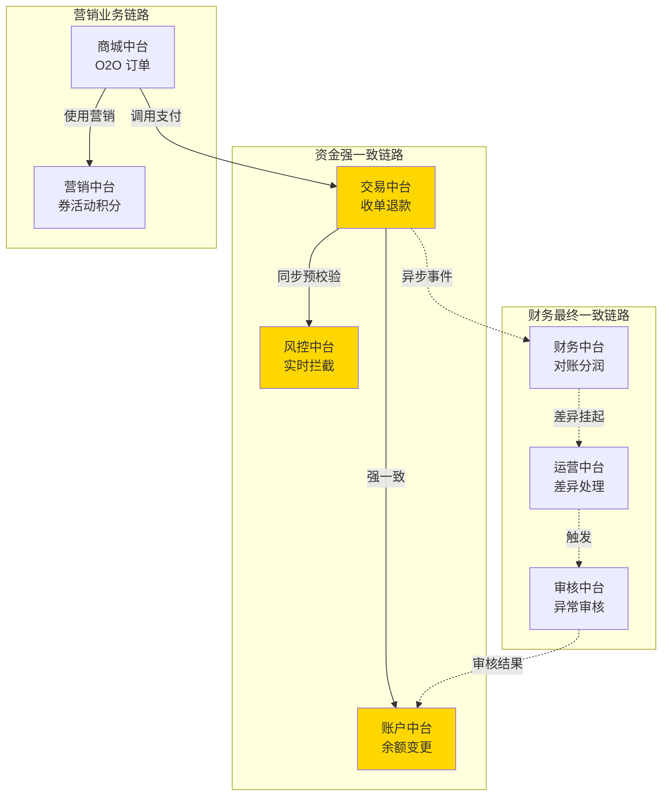
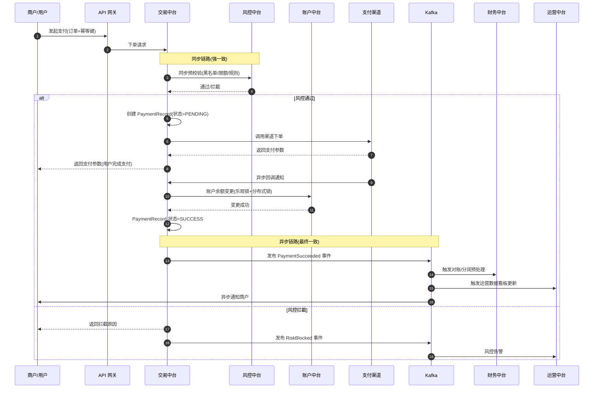
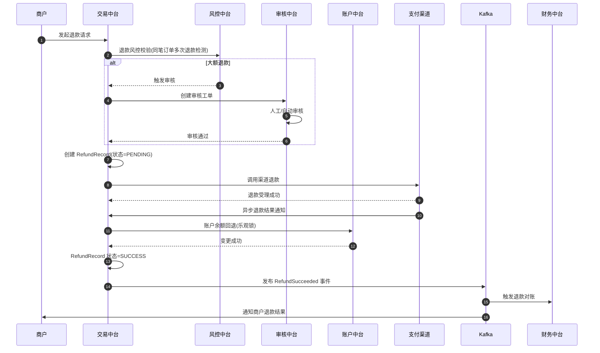
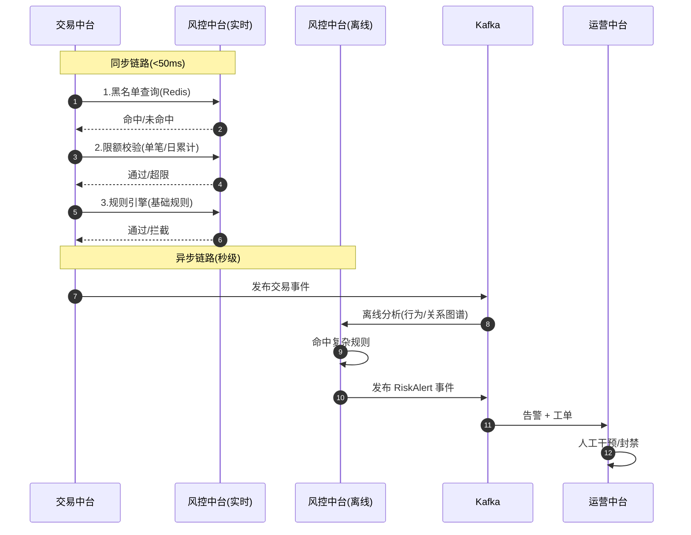
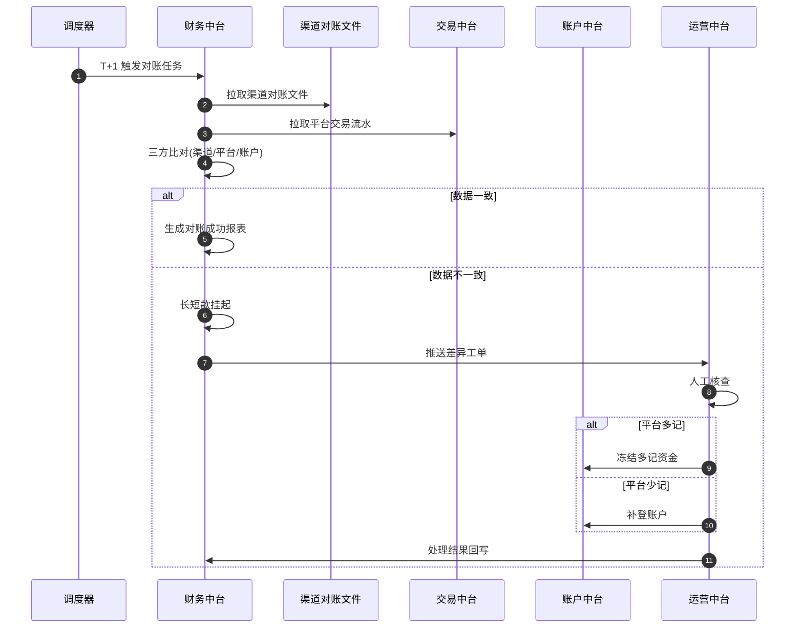
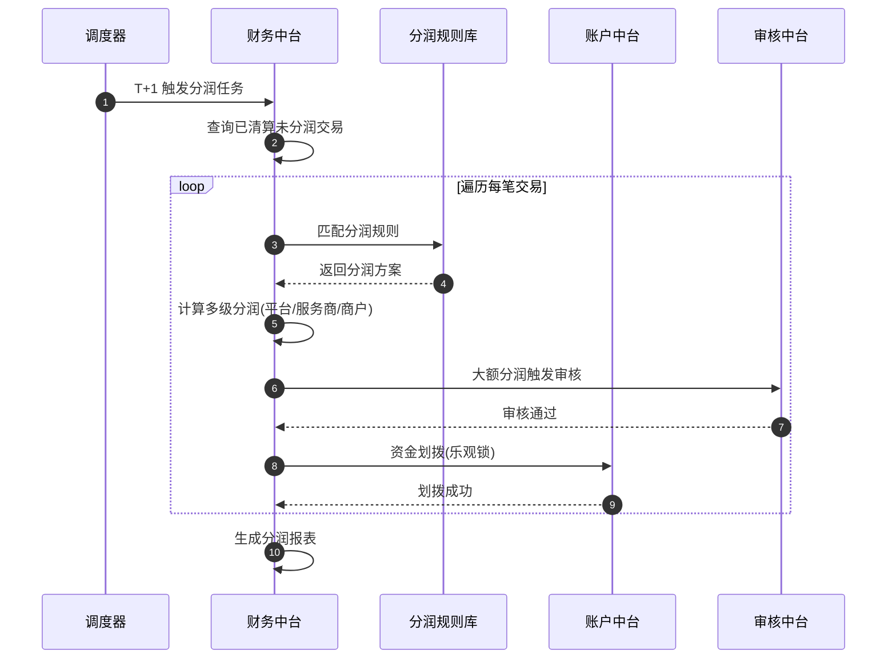
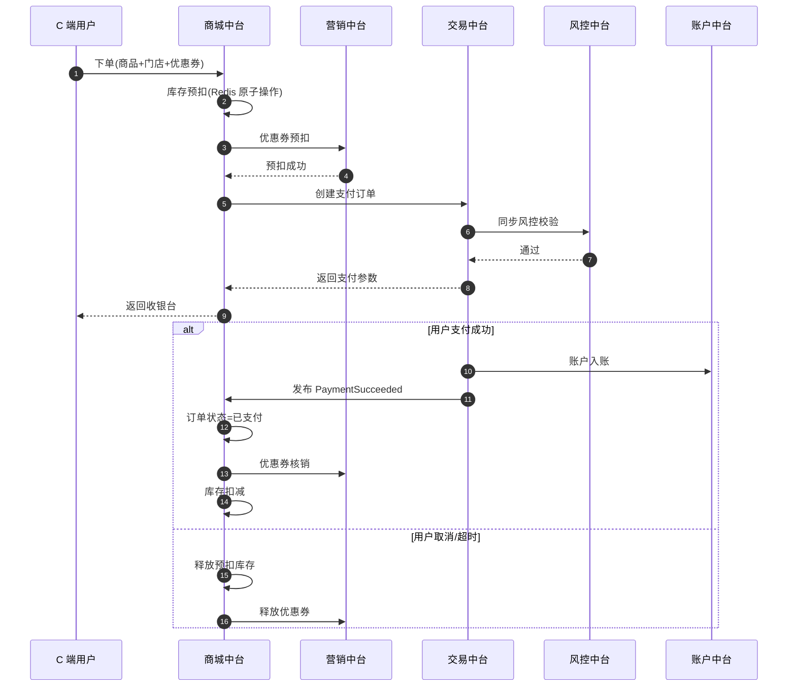

# 业务设计与关系图

> 华鑫融汇聚合支付网关 —— 业务能力中台战略设计文档
>
> **定位**：用于部门总监二面，阐述业务整体设计、能力地图、关键流程与领域关系。
>
> **设计哲学**：以"业务能力中台"为骨架，沉淀可复用能力（风控、账户、对账、分润等），上层承载多业务线（聚合支付、O2O 商城、运营管理）。

---

## 目录

1. [业务背景与战略定位](#1-业务背景与战略定位)
2. [业务能力中台地图](#2-业务能力中台地图)
3. [八大业务能力域详解](#3-八大业务能力域详解)
4. [业务能力关系图](#4-业务能力关系图)
5. [核心业务实体关系（ER 图）](#5-核心业务实体关系er-图)
6. [核心业务执行流程](#6-核心业务执行流程)
7. [业务流程挑战与设计取舍](#7-业务流程挑战与设计取舍)
8. [二面讲解要点](#8-二面讲解要点)

---

## 1. 业务背景与战略定位

### 1.1 业务定位

华鑫融汇定位为**多业务聚合支付平台**，从单一支付网关向"支付 + 商城 + 运营"复合业务演进。

```
┌──────────────────────────────────────────────────────────┐
│                  华鑫融汇业务全景                          │
├──────────────────────────────────────────────────────────┤
│                                                            │
│   ┌─────────────┐   ┌─────────────┐   ┌─────────────┐   │
│   │ 聚合支付业务 │   │ O2O 商城业务 │   │ 运营管理业务 │   │
│   │ (收单/退款) │   │ (商品/订单) │   │ (CRM/售后)  │   │
│   └──────┬──────┘   └──────┬──────┘   └──────┬──────┘   │
│          │                  │                  │           │
│          └──────────────────┴──────────────────┘           │
│                             │                              │
│                    ┌────────▼────────┐                     │
│                    │ 业务能力中台    │                     │
│                    │ (8 大能力中心)  │                     │
│                    └─────────────────┘                     │
└──────────────────────────────────────────────────────────┘
```

### 1.2 战略目标

| 目标 | 说明 |
|------|------|
| **能力复用** | 风控/账户/对账/分润等能力一次建设,多业务线复用 |
| **业务解耦** | 上层业务变化不影响核心能力,支持快速试错 |
| **资金安全** | 强一致资金链路 + 完整审计可追溯 |
| **运营提效** | 异常自动告警 + 工单闭环 + 数据看板 |

### 1.3 演进路径

```
当前阶段(已完成)              目标阶段(本文档)                未来阶段
─────────────                 ─────────────                 ─────────────
聚合支付网关         ──→    业务能力中台 +      ──→     开放平台 +
(订单/支付/退款/账户)        多业务线扩展                生态合作
```

---

## 2. 业务能力中台地图

### 2.1 八大业务能力域总览



### 2.2 能力域职责矩阵

| 能力域 | 核心能力 | 主要消费方 | 一致性要求 |
|--------|---------|-----------|-----------|
| **交易中台** | 收单/路由/退款/分账 | 聚合支付、商城 | 强一致(资金链路) |
| **账户中台** | 钱包/虚拟账户/资金流水 | 交易、财务、商城 | 强一致(余额变更) |
| **风控中台** | 规则引擎/黑白名单/限额 | 交易、审核、提现 | 同步预校验 + 异步后置 |
| **审核中台** | 准入/资质/提现/异常审核 | 运营、商户管理 | 异步工作流 |
| **财务中台** | 对账/分润/清算/报表 | 交易、运营 | 最终一致(T+1 批次) |
| **营销中台** | 券/活动/积分/返佣 | 商城、用户 | 最终一致(预扣 + 确认) |
| **商城中台** | 商品/订单/库存/门店 | O2O 业务、用户 | 强一致(库存) + 最终一致(订单) |
| **运营中台** | CRM/售后/工单/异常处理 | 运营人员、客服 | 最终一致 |

---

## 3. 八大业务能力域详解

### 3.1 交易中台(Trade Center)

**职责**：聚合收银台,统一对接微信/支付宝/银联/数字货币等多渠道。

| 能力 | 说明 |
|------|------|
| 收单服务 | 统一下单接口,聚合多渠道 |
| 支付路由 | 智能选渠道(费率/成功率/限额) |
| 退款服务 | 原路退款/指定渠道退款 |
| 分账服务 | 一笔交易多方分账(平台/商户/服务商) |
| 通知服务 | 异步回调商户 |

**关键挑战**：
- 重复支付防护(幂等键 + 状态机)
- 支付路由动态选路(成功率/费率)
- 渠道异步通知的最终一致性

### 3.2 账户中台(Account Center)

**职责**：统一账户体系,管理虚拟账户与资金流水。

| 能力 | 说明 |
|------|------|
| 商户账户 | 余额/冻结/可用三态管理 |
| 用户钱包 | 用户余额账户 |
| 虚拟账户 | 银行级虚拟子账户 |
| 资金流水 | 每笔资金变动可追溯 |
| 备付金账户 | 监管合规 |

**关键挑战**：
- 余额变更强一致(乐观锁 + 分布式锁)
- 资金流水不可篡改(只增不删 + 哈希链)
- T+0 提现与监管合规

### 3.3 风控中台(Risk Center)

**职责**：实时 + 离线双层风控,事前拦截 + 事后分析。

| 能力 | 说明 |
|------|------|
| 规则引擎 | 配置化规则(金额/频次/地域) |
| 黑白名单 | 商户/用户/设备/IP 维度 |
| 反欺诈 | 设备指纹/行为分析/关系图谱 |
| 限额管理 | 单笔/日/月/维度限额 |
| 实时拦截 | 同步预校验(50ms 内) |
| 离线分析 | 异步复杂规则/模型 |

**关键挑战**：
- 同步链路性能要求高(<50ms)
- 规则版本管理与灰度发布
- 误拦截与漏拦截的平衡

### 3.4 审核中台(Audit Center)

**职责**：工作流引擎,统一处理各类审核业务。

| 能力 | 说明 |
|------|------|
| 商户准入 | 资质审核/合规审查 |
| 提现审核 | 大额提现人工复核 |
| 异常订单 | 风险订单挂起处理 |
| 资质变更 | 商户信息变更审核 |
| 工作流引擎 | 多级审批/会签/回退 |

**关键挑战**：
- 审核规则可配置化
- 审核超时自动通过/拒绝策略
- 审核留痕与可追溯

### 3.5 财务中台(Finance Center)

**职责**：财务结算闭环,确保平台与渠道/商户资金一致。

| 能力 | 说明 |
|------|------|
| 对账服务 | T+1 批次对账(渠道/平台/商户三方) |
| 分润服务 | 多级分润规则匹配与计算 |
| 清算结算 | 资金划拨与结算单生成 |
| 财务报表 | 日报/月报/年报 |
| 差异处理 | 长短款挂起 + 运营处理 |

**关键挑战**：
- 渠道对账文件格式异构(微信/支付宝/银联格式不同)
- 分润规则可配置化(固定比例/阶梯/分润链)
- T+1 批处理的性能与失败重试

### 3.6 营销中台(Marketing Center)

**职责**：营销活动统一管理,支持多业务线复用。

| 能力 | 说明 |
|------|------|
| 优惠券 | 满减/折扣/代金券 |
| 活动 | 限时秒杀/拼团 |
| 积分 | 消费积分/任务积分 |
| 返佣 | 多级推广返佣 |

**关键挑战**：
- 券的预扣 + 确认 + 回滚
- 高并发场景下的库存与防超卖
- 营销规则与支付/对账的协同

### 3.7 商城中台(Mall Center)

**职责**：O2O 商城能力,支撑线上下单 + 线下核销。

| 能力 | 说明 |
|------|------|
| 商品管理 | SKU/SPU/价格/上下架 |
| 订单中心 | 商城订单(区别于支付订单) |
| 库存管理 | 门店库存/中心仓库存 |
| 门店管理 | 多门店/营业时间/区域 |
| 核销 | 二维码核销/到店核销 |

**关键挑战**：
- 商城订单与支付订单的关联
- 库存预扣与超卖防护
- 多门店订单路由

### 3.8 运营中台(Operation Center)

**职责**：运营管理后台,异常处理与客户服务。

| 能力 | 说明 |
|------|------|
| CRM | 商户/用户档案与标签 |
| 售后工单 | 退款申请/投诉处理 |
| 异常支付 | 重复支付/掉单处理 |
| 订单运营 | 订单查询/干预/退款 |
| 数据看板 | 实时交易/异常/风控指标 |

**关键挑战**：
- 异常订单的自动识别 + 人工兜底
- 工单流转效率
- 数据看板的实时性

---

## 4. 业务能力关系图

### 4.1 业务能力依赖关系



### 4.2 业务域职责边界（C4 Context 风格）



---

## 5. 核心业务实体关系（ER 图）

### 5.1 全局核心实体关系

```mermaid
erDiagram
    Merchant ||--o{ Account : "1:N 商户账户"
    Merchant ||--o{ MerchantAudit : "1:N 准入审核"
    User ||--o{ Account : "1:N 用户钱包"
    User ||--o{ WalletEvent : "1:N 钱包流水"

    Account ||--o{ AccountTransaction : "1:N 资金流水"
    Account ||--o{ FreezeRecord : "1:N 冻结记录"

    Order ||||--|{ PaymentRecord : "1:N 支付记录"
    Order ||--o| RefundRecord : "1:1 退款"
    Order ||--o{ OrderItem : "1:N 订单项"

    PaymentRecord ||--o{ ChannelNotification : "1:N 渠道回调"
    PaymentRecord ||--o{ RiskCheck : "1:N 风控校验"
    PaymentRecord ||--o{ SettlementRecord : "1:1 清算记录"

    RefundRecord ||--o{ AuditTask : "1:1 退款审核"

    SettlementRecord ||--o{ ProfitShare : "1:N 分润明细"
    SettlementRecord ||--o{ Reconciliation : "1:1 对账记录"

    Coupon ||--o{ Order : "1:N 优惠券使用"
    Product ||--o{ OrderItem : "1:N 商品订单"
    Store ||--o{ Product : "1:N 门店商品"
    Store ||--o{ Order : "1:N 门店订单"

    Merchant {
        string MerchantId PK
        string Name
        string Status
        string Level
    }
    Account {
        string AccountId PK
        string OwnerId FK
        string AccountType
        decimal Balance
        decimal Frozen
        decimal Available
        int Version
    }
    Order {
        string OrderId PK
        string MerchantId FK
        decimal Amount
        string Status
        string PayOrderId
    }
    PaymentRecord {
        string PaymentId PK
        string OrderId FK
        string Channel
        decimal Amount
        string Status
        string IdempotentKey
    }
    AccountTransaction {
        string TxnId PK
        string AccountId FK
        decimal Amount
        string Direction
        string BizType
        string HashPrev
    }
    SettlementRecord {
        string SettlementId PK
        string PaymentId FK
        decimal MerchantAmount
        decimal PlatformFee
        string Status
    }
    ProfitShare {
        string ProfitId PK
        string SettlementId FK
        string Receiver
        decimal Amount
        string ProfitType
    }
```

### 5.2 关键实体说明

| 实体 | 说明 | 一致性要求 |
|------|------|-----------|
| **Account** | 账户(余额/冻结/可用三态) | 强一致,乐观锁 |
| **AccountTransaction** | 资金流水(只增不改,哈希链) | 强一致,审计 |
| **PaymentRecord** | 支付记录(幂等键防重) | 强一致 |
| **SettlementRecord** | 清算记录(T+1 生成) | 最终一致 |
| **ProfitShare** | 分润明细(多级分润) | 最终一致 |
| **AuditTask** | 审核工单(工作流) | 最终一致 |

---

## 6. 核心业务执行流程

### 6.1 支付下单全链路（同步强一致 + 异步解耦）



**关键设计点**：
- **幂等键**：商户订单号 + 幂等键,防止重复支付
- **同步预校验**：风控规则 < 50ms
- **乐观锁 + 分布式锁**：账户余额变更双保险
- **状态机驱动**：PaymentRecord 状态机(PENDING→SUCCESS→SETTLED)

### 6.2 退款链路（同步退款 + 异步审核）



### 6.3 风控执行链路（同步预校验 + 异步后置审计）



### 6.4 对账闭环链路（T+1 批次）



### 6.5 分润结算链路（T+1 批次）



### 6.6 O2O 商城下单链路



---

## 7. 业务流程挑战与设计取舍

### 7.1 同步 vs 异步的取舍

| 链路 | 选择 | 理由 |
|------|------|------|
| 支付下单 | **同步** | 资金链路必须强一致,用户需立即拿到结果 |
| 风控预校验 | **同步** | 实时拦截,延迟敏感(<50ms) |
| 风控后置审计 | **异步** | 复杂规则耗时,允许秒级延迟 |
| 账户余额变更 | **同步** | 资金强一致,乐观锁 + 分布式锁 |
| 退款审核 | **异步** | 大额退款需人工,允许 T+0 |
| 对账分润 | **异步** | T+1 批次,无实时要求 |
| 通知商户 | **异步** | 商户回调可能失败,需重试 |

### 7.2 一致性策略

| 业务 | 策略 | 实现 |
|------|------|------|
| 账户余额 | **强一致** | DB 事务 + 乐观锁 + 分布式锁 |
| 支付状态 | **强一致** | 状态机 + 幂等键 |
| 跨服务事务 | **Saga** | 编排式 + 补偿事务 |
| 退款 + 库存回滚 | **TCC** | Try-Confirm-Cancel |
| 对账分润 | **最终一致** | 本地消息表 + Kafka 重试 |
| 通知商户 | **最终一致** | 消息重试 + 死信队列 |

### 7.3 业务能力中台的取舍

**优势**：
- 能力一次建设,多业务线复用(风控/账户/对账)
- 上层业务快速试错,不影响底层
- 数据统一,跨业务线分析

**代价**：
- 中台建设初期投入大(团队/架构)
- 能力演进需多业务线协调
- 公共能力变更影响面广

---

## 8. 二面讲解要点

### 8.1 三分钟讲清业务全貌

> "我们把整个平台抽象为 8 大业务能力中台:交易、账户、风控、审核、财务、营销、商城、运营。
> 上层承载聚合支付、O2O 商城、运营管理三大业务线,共享底层能力。
> 资金链路用同步强一致(乐观锁 + 分布式锁),对账分润用 T+1 异步批处理。
> 风控采用同步预校验 + 异步后置审计双层架构,既不影响交易性能,又能识别复杂欺诈。"

### 8.2 必被追问的问题与回答

#### Q1: 为什么用业务能力中台而不是直接按业务线拆?

> "直接按业务线拆会导致能力重复建设,比如聚合支付和 O2O 商城都需要风控/账户能力。
> 中台沉淀共享能力,一次建设多业务线复用,同时上层业务可以独立演进。
> 代价是初期投入大,所以中台建设要选准高复用能力(风控/账户/对账)优先沉淀。"

#### Q2: 支付链路怎么保证不重复扣款?

> "三层防护:
> 1. 幂等键:商户订单号 + 幂等键,API 层去重
> 2. PaymentRecord 状态机:PENDING→SUCCESS 不可逆,重复请求直接返回原结果
> 3. 账户变更乐观锁:余额变更必须带 version,失败重试 3 次
> 加上分布式锁(Redis + ZK 双锁)防止并发扣款。"

#### Q3: 对账发现长短款怎么处理?

> "T+1 对账跑批,差异自动挂起推送给运营中台生成工单。
> 平台多记:冻结多记资金,等渠道退款或运营确认后回滚
> 平台少记:补登账户,生成资金流水(哈希链留痕)
> 所有差异处理必须留痕,可审计可追溯。"

#### Q4: 风控同步预校验性能怎么保证?

> "实时风控三层:
> 1. L1 缓存(Redis):黑白名单/限额热数据
> 2. L2 规则引擎:基础规则同步执行(<20ms)
> 3. L3 离线分析:复杂规则异步,通过 Kafka 推送告警
> 整个同步链路控制在 50ms 内,不影响支付性能。
> 复杂关系图谱/行为分析放到离线,允许秒级延迟。"

#### Q5: 分润规则如何设计?

> "分润规则表设计为可配置:
> - 分润维度:平台/服务商/商户/推广员
> - 分润方式:固定比例/阶梯/分润链(多级)
> - 触发条件:交易金额/品类/渠道
> T+1 批处理时按规则匹配计算,大额分润触发审核。
> 资金划拨通过账户中台乐观锁保证一致性,失败重试。"

#### Q6: 为什么资金链路用 Saga 而不是 2PC?

> "2PC 在跨服务跨数据库场景下性能差且阻塞资源。
> Saga 编排式 + 补偿事务更适合长链路:
> - 每个步骤都有补偿动作(退款失败 → 回滚账户)
> - 失败时按反向顺序执行补偿
> - 业务可见性强,易调试
> 缺点是不保证隔离性,需要业务层处理中间状态(如订单显示'退款中')。"

#### Q7: 异常支付订单怎么自动识别?

> "三个识别机制:
> 1. 同步:状态机超时检测(PENDING 超 30 分钟未回调)
> 2. 异步:Kafka 消费者扫描掉单(支付参数已下发但无回调)
> 3. 离线:对账时发现渠道已成功但平台未入账
> 识别后自动生成工单推送给运营中台,自动补偿 + 人工兜底。"

### 8.3 讲解节奏建议

| 时长 | 内容 |
|------|------|
| 0-1 分钟 | 业务背景 + 战略定位 + 中台地图 |
| 1-3 分钟 | 八大能力域职责(挑 3 个重点讲:交易/风控/财务) |
| 3-5 分钟 | 核心链路(挑 1-2 个讲:支付全链路 + 对账闭环) |
| 5-7 分钟 | 设计取舍(同步/异步 + 一致性策略) |
| 7-10 分钟 | 答疑 + 挑战点展开 |

---

## 9. 参考资源

- 现有项目代码: [src/PaymentGateway.Domain](file:///c:/Users/ZJN/Desktop/jl/project/src/PaymentGateway.Domain)
- Saga 模式: [docs/16-企业级Saga通信方式详解.md](file:///c:/Users/ZJN/Desktop/jl/project/docs/16-企业级Saga通信方式详解.md)
- Kafka 异步事件: [docs/20-Kafka详解.md](file:///c:/Users/ZJN/Desktop/jl/project/docs/20-Kafka详解.md)
- 分布式锁: [docs/19-ZooKeeper详解.md](file:///c:/Users/ZJN/Desktop/jl/project/docs/19-ZooKeeper详解.md)
