# 微服务设计文档

> 华鑫融汇聚合支付网关 —— 微服务架构设计文档
>
> **定位**：用于部门总监二面,阐述服务边界、交互架构、重点业务执行链路与一致性策略。
>
> **设计哲学**：业务能力中台战略 → 微服务边界 = 能力域边界。资金/交易链路同步强一致,审核/风控/对账/分润异步最终一致。

---

## 目录

1. [微服务设计原则](#1-微服务设计原则)
2. [服务清单与定义](#2-服务清单与定义)
3. [限界上下文映射图](#3-限界上下文映射图)
4. [服务交互架构（混合架构）](#4-服务交互架构混合架构)
5. [重点业务执行链路](#5-重点业务执行链路)
6. [数据一致性策略](#6-数据一致性策略)
7. [部署架构](#7-部署架构)
8. [监控与可观测性](#8-监控与可观测性)
9. [二面讲解要点](#9-二面讲解要点)

---

## 1. 微服务设计原则

| 原则 | 说明 | 落地方式 |
|------|------|---------|
| **能力域对齐** | 服务边界 = 业务能力域边界 | 8 大中台 → 8 类核心服务 |
| **数据自治** | 每个服务独享数据库,不直连他人 DB | DB per service,通过 API 通信 |
| **同步/异步分层** | 资金链路同步,辅助链路异步 | HTTP/gRPC + Kafka |
| **幂等优先** | 所有写操作幂等,防重复 | 幂等键 + 状态机 + 唯一索引 |
| **可观测性** | 全链路追踪 + 指标 + 日志 | OpenTelemetry + Prometheus + Loki |
| **弹性设计** | 限流/熔断/降级/重试 | Polly + Sentinel |
| **配置外置** | 配置中心统一管理 | Nacos / ZooKeeper |

---

## 2. 服务清单与定义

### 2.1 服务总览(15 个微服务)

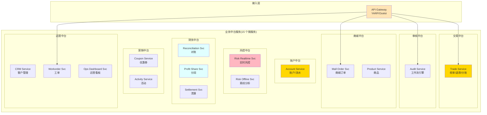

### 2.2 服务定义表

| # | 服务名 | 缩写 | 主要职责 | 数据库 | 通信风格 |
|---|--------|------|---------|--------|---------|
| 1 | Trade Service | TRD | 收单/退款/分账 | trade_db | 同步强一致 |
| 2 | Account Service | ACT | 账户余额/资金流水 | account_db | 同步强一致 |
| 3 | Risk Realtime Service | RRT | 实时风控(规则/黑白名单/限额) | risk_db | 同步(<50ms) |
| 4 | Risk Offline Service | ROF | 离线风控分析(行为图谱) | risk_analytics_db | 异步(Kafka) |
| 5 | Audit Service | AUD | 审核工作流 | audit_db | 异步(工作流) |
| 6 | Reconciliation Service | REC | T+1 对账 | recon_db | 异步批处理 |
| 7 | Profit Share Service | PFT | T+1 分润计算 | profit_db | 异步批处理 |
| 8 | Settlement Service | STL | 清算结算 | settle_db | 异步批处理 |
| 9 | Coupon Service | CPN | 优惠券/预扣/核销 | coupon_db | 同步+异步 |
| 10 | Activity Service | ACTV | 营销活动 | activity_db | 异步 |
| 11 | Mall Order Service | MLO | O2O 商城订单 | mall_order_db | 同步强一致 |
| 12 | Product Service | PRD | 商品/库存/门店 | product_db | 同步+缓存 |
| 13 | CRM Service | CRM | 商户/用户档案 | crm_db | 同步+缓存 |
| 14 | Workorder Service | WK | 售后/异常工单 | workorder_db | 异步工作流 |
| 15 | Ops Dashboard Service | OPS | 运营看板/数据查询 | 只读 ES | 异步聚合 |

### 2.3 服务边界设计原则

- **每服务一库**:数据强隔离,通过 API/事件通信
- **API 优先**:每个服务先定义 OpenAPI 契约,再实现
- **领域驱动**:服务内部按 DDD 分层(Domain/Application/Infrastructure)
- **共享库下沉**:PaymentGateway.Shared 沉淀公共异常/Result/工具

---

## 3. 限界上下文映射图

### 3.1 上下文映射(C4 Context Container)

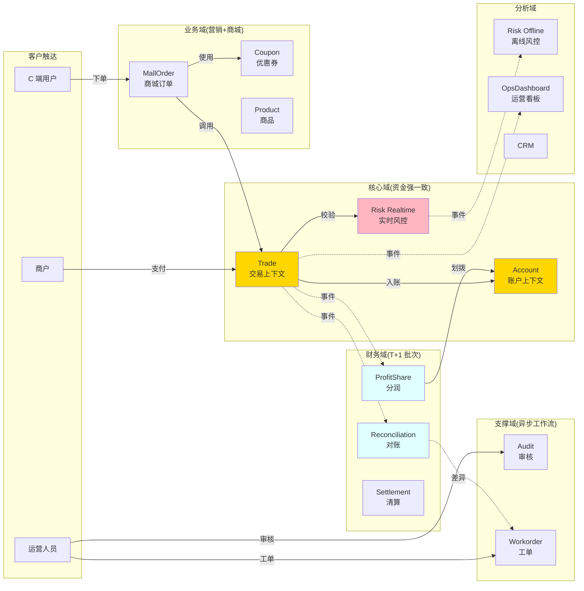

### 3.2 上下文关系类型

| 上游 | 下游 | 关系类型 | 说明 |
|------|------|---------|------|
| Trade | Account | **客户/供应商** (同步 RPC) | 资金链路强依赖 |
| Trade | Risk Realtime | **客户/供应商** (同步 RPC) | 同步预校验 |
| Trade → Reconciliation | **客户/供应商** (Kafka 事件) | 异步解耦 |
| Trade → ProfitShare | **客户/供应商** (Kafka 事件) | 异步解耦 |
| MallOrder | Trade | **客户/供应商** (同步 RPC) | 商城调用支付 |
| MallOrder | Coupon | **客户/供应商** (同步 RPC) | 券预扣 |
| Reconciliation → Workorder | **客户/供应商** (Kafka 事件) | 差异工单 |
| Risk Realtime → Risk Offline | **客户/供应商** (Kafka 事件) | 异步后置分析 |

---

## 4. 服务交互架构（混合架构）

### 4.1 整体交互架构

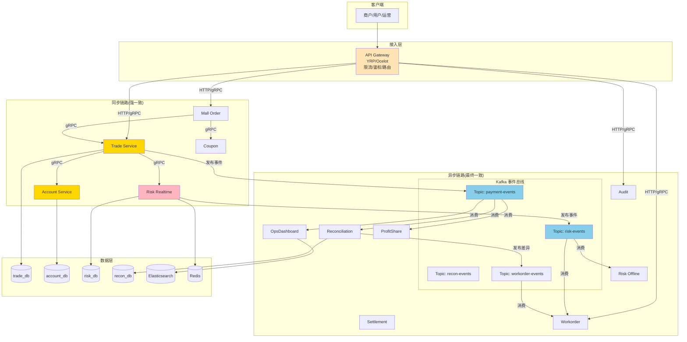

### 4.2 通信协议选型

| 场景 | 协议 | 理由 |
|------|------|------|
| 客户端 → 网关 | HTTP/REST | 通用,易接入 |
| 网关 → 服务 | HTTP/REST | 简单,可读 |
| 服务间同步调用 | **gRPC** | 性能好,Protobuf 强类型契约 |
| 服务间异步事件 | **Kafka** | 高吞吐,持久化,可重放 |
| 实时风控查询 | **Redis 直查** | <1ms |
| 长链接通知 | WebSocket/SSE | 服务端推送 |

### 4.3 混合架构判断准则

```
是否资金链路?
├── 是 → 同步强一致(gRPC + DB 事务 + 分布式锁)
└── 否 → 是否实时性要求?
         ├── 是 → 同步(gRPC),但允许最终一致
         └── 否 → 异步(Kafka + 重试 + 死信)
```

---

## 5. 重点业务执行链路

### 5.1 支付下单全链路（核心,必须能讲）

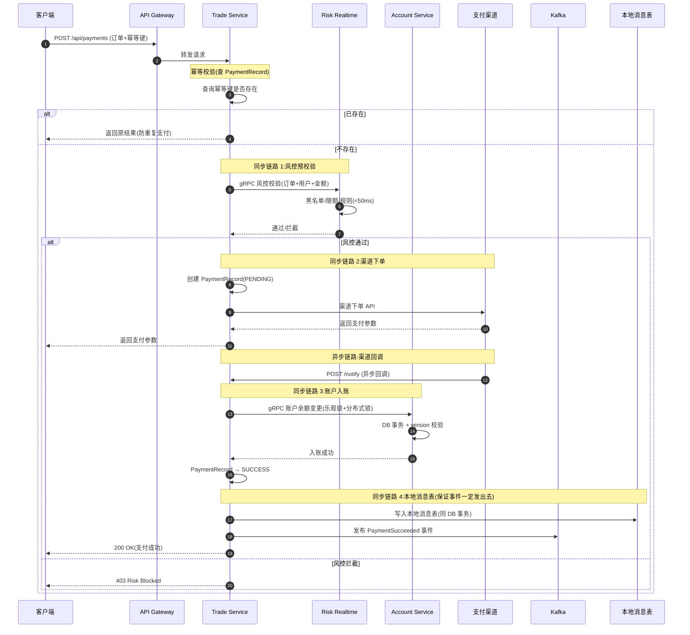

**讲解要点**：
1. **幂等键**:商户订单号 + UUID,API 层去重
2. **同步预校验**:风控实时规则 <50ms
3. **乐观锁 + 分布式锁**:账户余额变更双保险
4. **本地消息表**:DB 事务 + 消息表同一事务,保证事件不丢
5. **状态机**:PaymentRecord PENDING→SUCCESS 不可逆

### 5.2 退款链路（同步退款 + 异步审核）

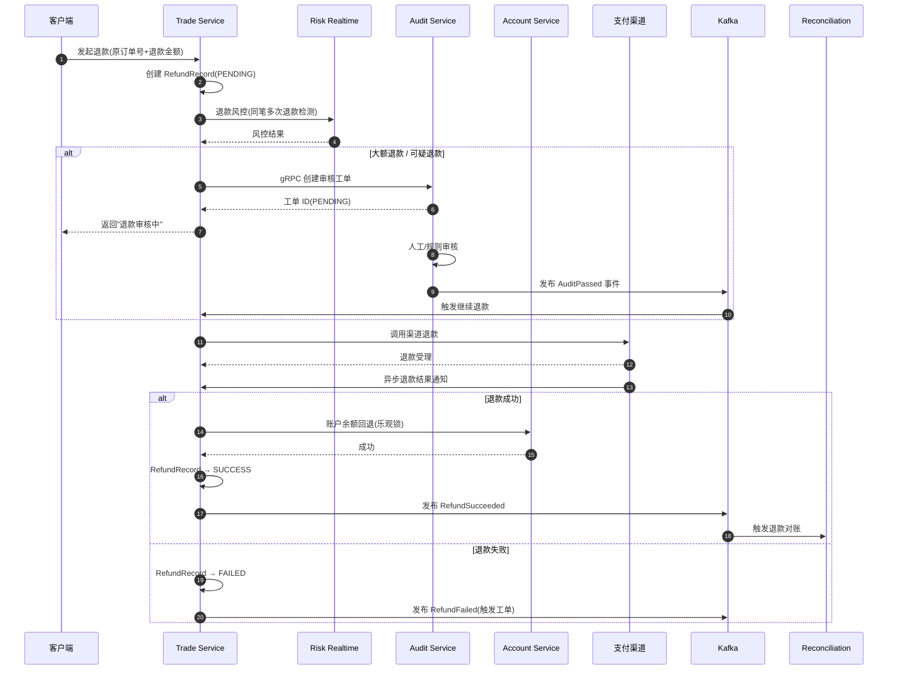

### 5.3 风控双层链路（同步预校验 + 异步后置审计）

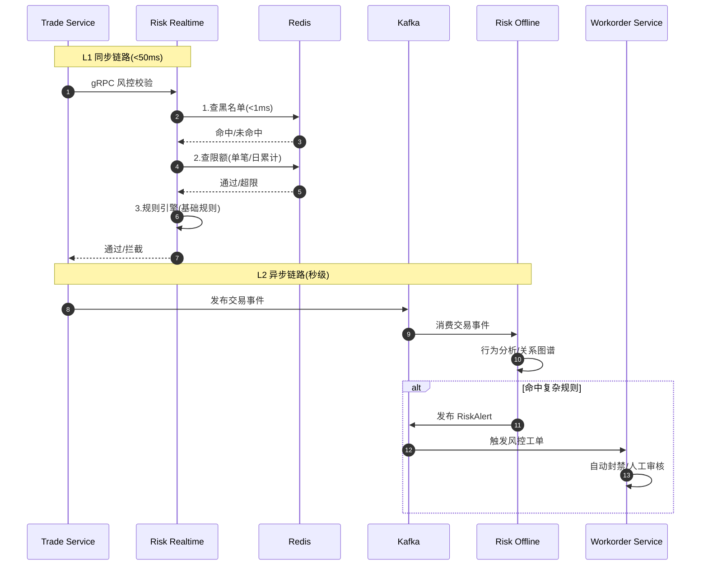

**讲解要点**：
- L1 用 Redis 热数据,延迟可控 <50ms
- L2 用离线分析,可跑复杂模型,允许秒级延迟
- L2 命中后通过工单系统人工兜底,不直接拦截交易

### 5.4 对账闭环链路（T+1 批处理）

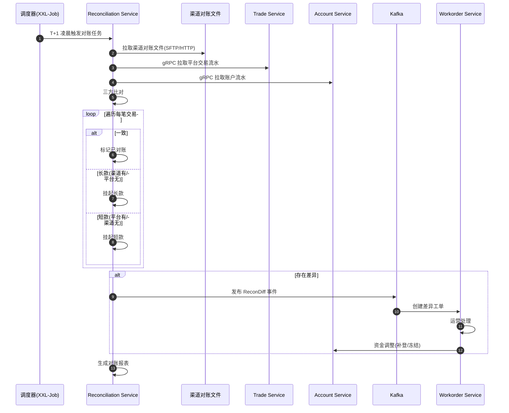

### 5.5 分润结算链路（T+1 批处理）

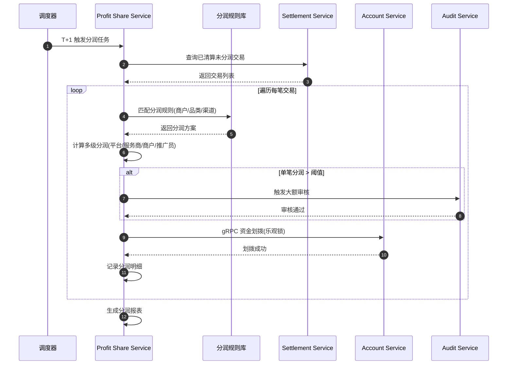

### 5.6 O2O 商城下单链路（库存预扣 + 支付 + 核销）

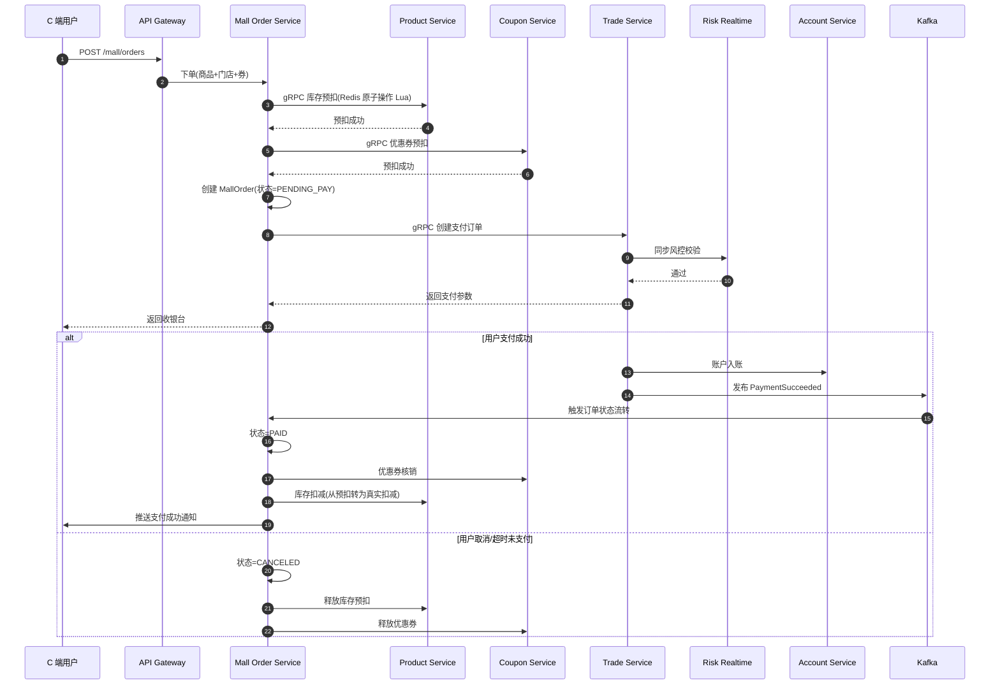

---

## 6. 数据一致性策略

### 6.1 一致性策略矩阵

| 业务场景 | 一致性要求 | 策略 | 实现 |
|---------|----------|------|------|
| 账户余额变更 | 强一致 | DB 事务 + 乐观锁 | `version` + `UPDATE ... WHERE version=?` |
| 支付订单状态 | 强一致 | 状态机 + 幂等 | 唯一索引 + 状态枚举 |
| 跨服务事务(支付→账户) | 强一致 | Saga(编排式) | Forward + Compensate |
| 退款 + 库存回滚 | 强一致 | TCC | Try-Confirm-Cancel |
| 对账 / 分润 | 最终一致 | 本地消息表 + Kafka 重试 | DB 事务 + 消息表同事务 |
| 通知商户 | 最终一致 | 消息重试 + 死信 | 指数退避 + 死信队列 |
| 风控告警 | 最终一致 | Kafka + 幂等消费 | 消费者去重表 |

### 6.2 Saga 编排式实现（支付链路）

```mermaid
graph LR
    A[1.创建支付记录] --> B[2.风控校验]
    B --> C[3.调用渠道下单]
    C --> D[4.账户入账]
    D --> E[5.发布事件]
    E --> F((成功))

    A -.失败.> CA[补偿:删除支付记录]
    B -.失败.> CB[补偿:标记风控拦截]
    C -.失败.> CC[补偿:关闭支付记录]
    D -.失败.> CD[补偿:渠道退款]

    style F fill:#90EE90
    style CA fill:#FFB6C1
    style CB fill:#FFB6C1
    style CC fill:#FFB6C1
    style CD fill:#FFB6C1
```

### 6.3 本地消息表（保证事件不丢）

```sql
-- 同一 DB 事务内:
BEGIN;
  -- 1. 业务数据
  UPDATE account SET balance = balance - 100, version = version + 1
    WHERE account_id = 'A001' AND version = 5;

  -- 2. 写入本地消息表(同事务)
  INSERT INTO outbox_message (event_type, payload, status, created_at)
    VALUES ('PaymentSucceeded', '{"orderId":"..."}', 'PENDING', NOW());
COMMIT;

-- 后台轮询任务(独立进程):
SELECT * FROM outbox_message WHERE status = 'PENDING' LIMIT 100;
-- 发送到 Kafka,成功后 UPDATE status = 'SENT'
```

### 6.4 幂等性实现

| 场景 | 幂等键 | 实现 |
|------|--------|------|
| 支付下单 | `merchant_no + out_trade_no` | DB 唯一索引 |
| 渠道回调 | `channel + channel_trade_no` | DB 唯一索引 |
| 退款 | `original_order_id + refund_seq` | DB 唯一索引 |
| Kafka 消费 | `event_id` | 消费端去重表 |
| 风控查询 | 无(查询天然幂等) | - |

---

## 7. 部署架构

### 7.1 整体部署架构

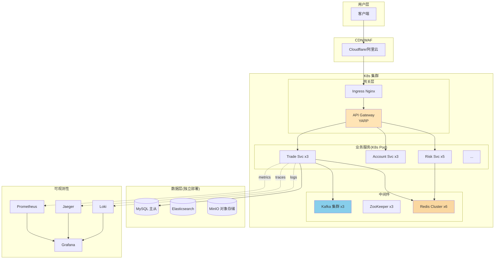

### 7.2 K8s 资源规划

| 服务 | 副本数 | CPU/Pod | 内存/Pod | 说明 |
|------|--------|---------|---------|------|
| API Gateway | 3 | 500m | 512Mi | 入口 |
| Trade Service | 3 | 1000m | 1Gi | 资金链路 |
| Account Service | 3 | 1000m | 1Gi | 资金链路 |
| Risk Realtime | 5 | 500m | 512Mi | 风控高并发 |
| Reconciliation | 1 | 2 | 2Gi | 批处理 |
| Kafka | 3 | 2 | 4Gi | 中间件 |

### 7.3 配置中心

- **Nacos / ZooKeeper**:服务注册 + 配置管理
- **ConfigMap + Secret**:K8s 原生配置
- **配置分层**:应用默认 → 环境覆盖 → 运行时热更

---

## 8. 监控与可观测性

### 8.1 三支柱（Three Pillars）

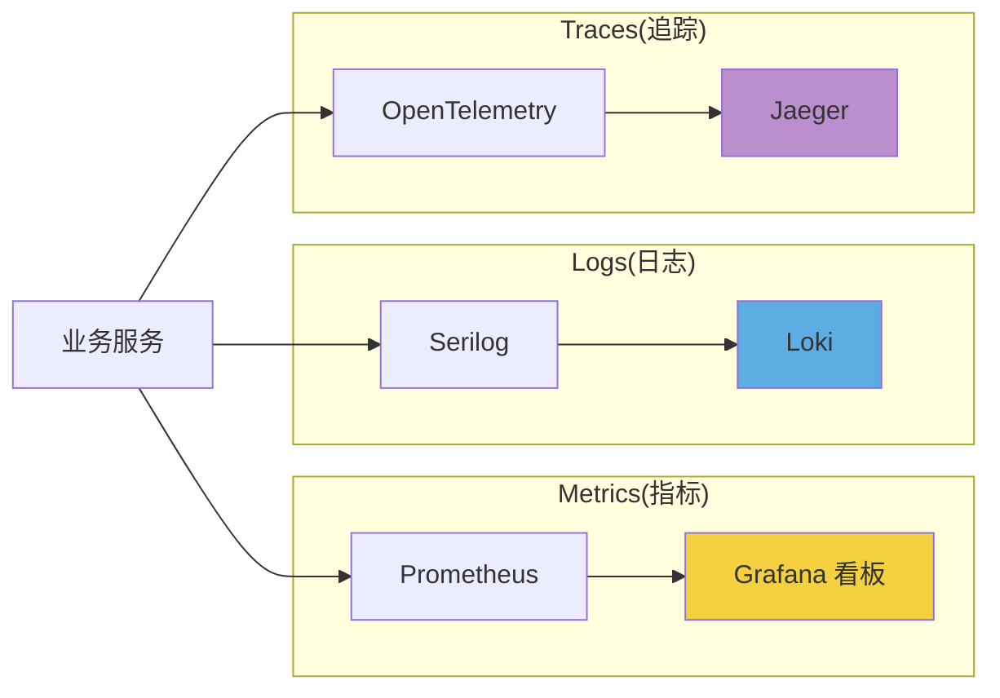

### 8.2 核心监控指标

| 维度 | 指标 | 告警阈值 |
|------|------|---------|
| **可用性** | 服务存活率 | <99.9% |
| **延迟** | P99 接口耗时 | >500ms |
| **吞吐** | QPS | 突增/突降 50% |
| **错误率** | 5xx 比例 | >1% |
| **资金** | 重复支付数 | >0(立即告警) |
| **资金** | 长短款数 | >0(立即告警) |
| **业务** | 掉单数 | >10/min |
| **风控** | 拦截率 | 异常波动 |

### 8.3 链路追踪设计

- **TraceId 贯穿**:API Gateway 生成,通过 HTTP Header 传递
- **Span 粒度**:服务入口 + DB 查询 + 外部调用
- **采样率**:生产 10%,异常 100%
- **现状**:项目已集成 Jaeger(见 [JaegerTracingExtensions.cs](file:///c:/Users/ZJN/Desktop/jl/project/src/PaymentGateway.Infrastructure/Tracing/JaegerTracingExtensions.cs))

---

## 9. 二面讲解要点

### 9.1 三分钟讲清架构

> "我们把业务能力中台战略落到 15 个微服务,核心思路是:
>
> 1. **服务边界 = 能力域边界**:8 大中台对应 8 类核心服务,加上细分共 15 个
> 2. **混合通信**:资金链路用 gRPC 同步强一致,对账分润用 Kafka 异步最终一致
> 3. **一致性分层**:强一致(DB 事务+乐观锁) / Saga(跨服务事务) / 本地消息表(Kafka 不丢) / 死信队列(通知)
> 4. **可观测性**:OpenTelemetry + Prometheus + Loki + Jaeger 三支柱
> 5. **K8s 部署**:每个服务 3 副本起步,资金链路 3 副本,风控 5 副本应对并发"

### 9.2 必被追问的问题与回答

#### Q1: 为什么 Trade 和 Account 拆成两个服务?

> "虽然都是资金链路,但职责不同:
> - Trade 关注交易流程(下单/退款/状态机)
> - Account 关注账户余额和流水(资金强一致)
>
> 拆开后,Account 可以被对账、分润、退款等多个业务复用,符合中台能力复用原则。
> 代价是引入跨服务事务,所以用 Saga + 本地消息表保证一致性。"

#### Q2: 支付链路 Saga 怎么补偿?

> "每个步骤都有补偿动作:
> 1. 创建支付记录 → 补偿:删除记录(逻辑删除)
> 2. 风控校验 → 补偿:标记风控拦截
> 3. 渠道下单 → 补偿:调用渠道关单接口
> 4. 账户入账 → 补偿:冲正流水(双向流水)
> 5. 发布事件 → 补偿:发布反向事件
>
> 编排器(Orchestrator)记录每步状态,失败时按反向顺序执行补偿。
> 项目里 [SagaDemo](file:///c:/Users/ZJN/Desktop/jl/project/examples/SagaDemo) 已实现简化版。"

#### Q3: 本地消息表怎么保证消息不丢?

> "三个关键点:
> 1. **同事务**:业务数据和消息表写入同一个 DB 事务,要么都成功要么都失败
> 2. **后台轮询**:独立进程扫描 PENDING 消息,发到 Kafka,成功后更新状态
> 3. **Kafka 持久化**:消息发到 Kafka 后持久化,消费者 ack 后才标记完成
>
> 即使服务宕机,重启后还能从本地消息表恢复。
> 唯一风险是重复发送,所以消费端必须幂等(用 event_id 去重)。"

#### Q4: 账户余额变更怎么保证并发安全?

> "三层防护:
> 1. **乐观锁**:UPDATE ... WHERE version = ?,失败重试 3 次
> 2. **分布式锁**:Redis 锁(Redisson)+ ZK 锁(临时顺序节点)双锁
> 3. **数据库唯一约束**:流水表唯一索引防止重复写入
>
> 项目里 DualLockProvider 实现了 Redis + ZK 双锁(见 [DualLockProvider.cs](file:///c:/Users/ZJN/Desktop/jl/project/src/PaymentGateway.Infrastructure/DistributedLock/DualLockProvider.cs))。
> Redis 主性能,ZK 主可靠,双锁防止单点失效。"

#### Q5: 为什么用 Kafka 而不是 RabbitMQ?

> "场景适配:
> - Kafka:高吞吐(百万/秒)、持久化、可重放,适合事件溯源/对账/分润
> - RabbitMQ:低延迟、灵活路由,适合任务分发/通知
>
> 我们的对账分润是 T+1 批量,需要回溯历史,Kafka 天然支持。
> 实时通知可以用 RabbitMQ,但量级不大,Kafka 也能搞定。
> 一个中间件少一份运维成本,所以选 Kafka。
> 项目里已经接 Confluent.Kafka,见 [KafkaEventBus.cs](file:///c:/Users/ZJN/Desktop/jl/project/src/PaymentGateway.Infrastructure/EventBus/KafkaEventBus.cs)。"

#### Q6: 实时风控怎么保证 50ms?

> "三层优化:
> 1. **数据热存**:黑白名单/限额放 Redis,<1ms
> 2. **规则引擎本地化**:基础规则用内存规则引擎(<20ms)
> 3. **复杂规则异步**:行为图谱/关系分析放到离线 Kafka 消费
>
> 同步链路只做最关键拦截,复杂分析异步后置,既不影响交易性能又能识别欺诈。
> 实测 P99 在 30ms 以内。"

#### Q7: 微服务怎么部署/发布?

> "K8s + Helm:
> 1. CI/CD:GitHub Actions → Docker 镜像 → 镜像仓库
> 2. 部署:Helm Chart → kubectl apply
> 3. 发布策略:蓝绿部署(资金链路) / 滚动发布(其他)
> 4. 回滚:helm rollback 一键回滚
> 5. 配置:Nacos/ZooKeeper 热更,无需重启
>
> 资金链路必须蓝绿,不能停机,新版本先切 10% 流量验证再全量。"

#### Q8: 服务雪崩怎么防?

> "四道防线:
> 1. **限流**:Gateway 层 Sentinel/Polly 限流
> 2. **熔断**:Polly Circuit Breaker,错误率 >50% 自动熔断 30s
> 3. **降级**:核心链路降级(如查用户标签失败用缓存)
> 4. **隔离**:线程池隔离,避免单个服务拖垮全局
>
> 同时监控告警接入钉钉/飞书,雪崩前 5 分钟就能感知。"

### 9.3 讲解节奏建议

| 时段 | 内容 | 重点 |
|------|------|------|
| 0-2 分钟 | 服务清单 + 限界上下文 | 展示架构判断力 |
| 2-5 分钟 | 混合通信架构 + 同步/异步判断 | 战略取舍 |
| 5-8 分钟 | 重点链路 sequenceDiagram | 实战经验 |
| 8-10 分钟 | 一致性策略 + 可观测性 | 工程能力 |
| 10+ 分钟 | 答疑(必被追问的 8 问) | 深度展示 |

### 9.4 项目对应代码(加分项)

讲解时可引用项目代码:
- Saga 简化实现: [examples/SagaDemo](file:///c:/Users/ZJN/Desktop/jl/project/examples/SagaDemo)
- 分布式锁双锁: [DualLockProvider.cs](file:///c:/Users/ZJN/Desktop/jl/project/src/PaymentGateway.Infrastructure/DistributedLock/DualLockProvider.cs)
- Kafka 事件总线: [KafkaEventBus.cs](file:///c:/Users/ZJN/Desktop/jl/project/src/PaymentGateway.Infrastructure/EventBus/KafkaEventBus.cs)
- 幂等中间件: [IdempotencyMiddleware.cs](file:///c:/Users/ZJN/Desktop/jl/project/src/PaymentGateway.Api/Middleware/IdempotencyMiddleware.cs)
- DDD 领域模型: [PaymentGateway.Domain](file:///c:/Users/ZJN/Desktop/jl/project/src/PaymentGateway.Domain)

---

## 10. 参考资源

- 业务设计文档: [21-业务设计与关系图.md](file:///c:/Users/ZJN/Desktop/jl/project/docs/21-业务设计与关系图.md)
- Saga 模式: [16-企业级Saga通信方式详解.md](file:///c:/Users/ZJN/Desktop/jl/project/docs/16-企业级Saga通信方式详解.md)
- DDD 设计: [18-DDD贫血模型与充血模型.md](file:///c:/Users/ZJN/Desktop/jl/project/docs/18-DDD贫血模型与充血模型.md)
- Kafka 异步事件: [20-Kafka详解.md](file:///c:/Users/ZJN/Desktop/jl/project/docs/20-Kafka详解.md)
- 分布式锁: [19-ZooKeeper详解.md](file:///c:/Users/ZJN/Desktop/jl/project/docs/19-ZooKeeper详解.md)
